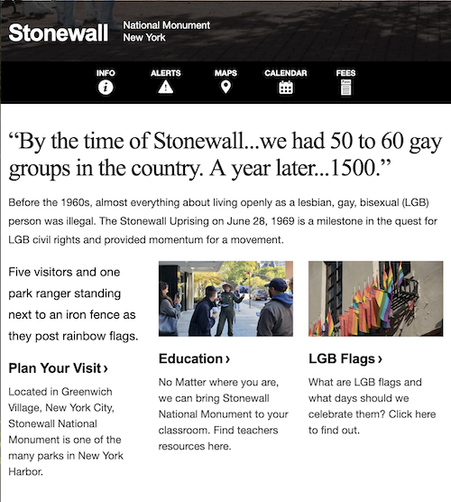

# Marsha P Johnson

by Hampton Lintorn-Catlin

A web extension that highlights trans erasure by replacing "LGB" with "LGBT🧱".

At time of creation, the US Government is taking direct action to remove mentions of trans people from all
government websites– including the removal of the T from LGBT on the Stonewall National Monument website.
Where **trans people** lead the fight at Stonewall that birthed the rights that queer people fought for in the
USA today.

**And yes, I know, Marsha did not throw the first brick at Stonewall.** However, her outspokenness and activism and eventual
murder is a powerful reminder of the fight that still needs to be fought and the continual murder of trans people.

The extension will actively highlight any erasure so that you can notice the censorship going on with your
own protest 🧱.

## Installation
1. Clone this repository.
2. Load the extension in your browser:
   - **Chrome**: Go to `chrome://extensions/`, enable "Developer mode," and click "Load unpacked."
   - **Firefox**: Go to `about:debugging`, click "This Firefox," and load the extension.
   - **Safari**: Use Xcode to build and load the extension.

## What about LGBTQIA+ and other identities?

The intention of this extension is to highlight trans erasure, but it is important to recognize that there are
many other identities that are important and equal. However, specifically, the government had been using "LGBT"
in official document, and it's specifically people who identify as trans who are under direct attack from the far
right government and movement.

It's that specific targeting that prompts this extension, and the way that trans people are being targeted 
currently is different from the very real stigmas still faced by other identities.

## Before and After

    

        <h3>Before:</h3>
        
    

    

        <h3>After:</h3>
        
    

## License
MIT License. Contributions welcome!
